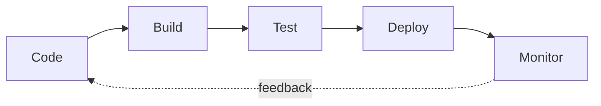
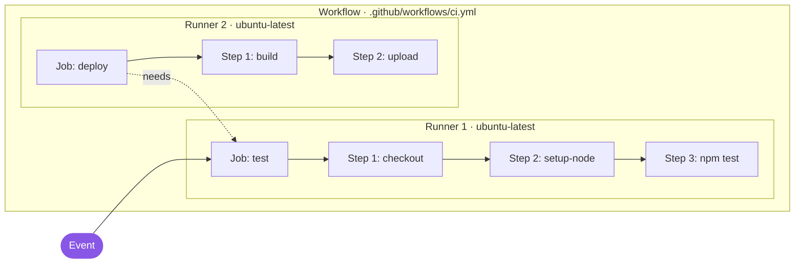
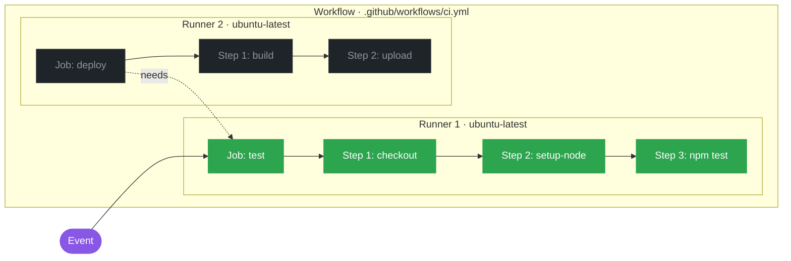
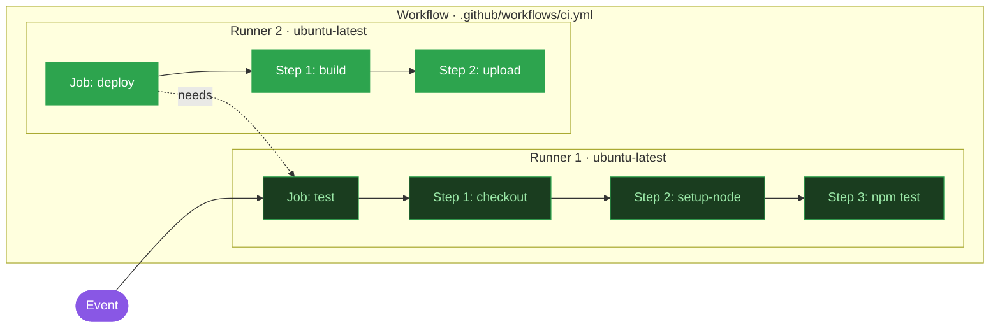

# GitHub Actions


<div class="abs-bl m-6 text-sm opacity-60">
  Anna Romankiewicz, MC Bachelor
<br> 13.05.2026
</div>

<div class="abs-br m-6 text-xl">
  <carbon:logo-github />
</div>

<style>
:root {
  --slidev-theme-primary: #2da44e;
}
h1 {
  background: linear-gradient(90deg, #2da44e 0%, #8957e5 100%);
  -webkit-background-clip: text;
  background-clip: text;
  color: transparent;
  font-weight: 800;
}
</style>


---
transition: fade-out
---

# Why CI/CD?


- **Continuous Integration** 
- **Continuous Deployment / Delivery** 


<div class="flex justify-center mt-12">



</div>


---

# What can you automate?

<br>
<br>

<div class="grid grid-cols-2 gap-4 mt-8">

<div class="p-3 rounded border border-green-500/30 bg-green-500/5">
  <div class="text-xl"><carbon:test-tool /></div>
  <div class="font-bold mt-1">Tests</div>
  <div class="text-xs opacity-70">On every Push and Pull Request</div>
</div>

<div class="p-3 rounded border border-green-500/30 bg-green-500/5">
  <div class="text-xl"><carbon:build-tool /></div>
  <div class="font-bold mt-1">Builds & Artifacts</div>
  <div class="text-xs opacity-70">Binaries, Bundles etc.</div>
</div>

<div class="p-3 rounded border border-purple-500/30 bg-purple-500/5">
  <div class="text-xl"><carbon:deploy /></div>
  <div class="font-bold mt-1">Deploys</div>
  <div class="text-xs opacity-70">GitHub Pages, AWS, other servers …</div>
</div>

<div class="p-3 rounded border border-purple-500/30 bg-purple-500/5">
  <div class="text-xl"><carbon:bot /></div>
  <div class="font-bold mt-1">Repo Automation</div>
  <div class="text-xs opacity-70">Label Pull Requests, Cron Jobs etc.</div>
</div>

</div>


---

# Components of GitHub Actions Workflow
<br>
<br>

<div class="grid grid-cols-2 gap-4 mt-8">

<div class="p-3 rounded border border-green-500/30 bg-green-500/5">
  <div class="font-bold text-green-400">Event</div>
  <div class="text-xs opacity-80 mt-1">An activity that triggers a workflow run.</div>
  <div class="mt-2 text-xs"><code>on: [push, pull_request]</code></div>
</div>

<div class="p-3 rounded border border-green-500/30 bg-green-500/5">
  <div class="font-bold text-green-400">Workflow</div>
  <div class="text-xs opacity-80 mt-1">The YAML file in <code>.github/workflows/</code> defining what runs.</div>
  <div class="mt-2 text-xs"><code>name: CI</code></div>
</div>

<div class="p-3 rounded border border-purple-500/30 bg-purple-500/5">
  <div class="font-bold text-purple-400">Job</div>
  <div class="text-xs opacity-80 mt-1">A set of steps executed on the same runner.</div>
  <div class="mt-2 text-xs"><code>jobs: { test: {...} }</code></div>
</div>

<div class="p-3 rounded border border-purple-500/30 bg-purple-500/5">
  <div class="font-bold text-purple-400">Step</div>
  <div class="text-xs opacity-80 mt-1">One unit — a <code>run:</code> shell command or a <code>uses:</code> action.</div>
  <div class="mt-2 text-xs"><code>- run: npm test</code></div>
</div>

</div>


---

# Components of GitHub Actions Workflow
<br>
<br>

<div class="grid grid-cols-3 gap-4 mt-8">

<div class="p-3 rounded border border-green-500/30 bg-green-500/5">
  <div class="font-bold text-green-400">Action</div>
  <div class="text-xs opacity-80 mt-1">Pre-built reusable code that a step can call.</div>
  <div class="mt-2 text-xs"><code>uses: actions/checkout@v4</code></div>
</div>

<div class="p-3 rounded border border-green-500/30 bg-green-500/5">
  <div class="font-bold text-green-400">Runner</div>
  <div class="text-xs opacity-80 mt-1">The VM (Linux / macOS / Windows) that executes a job. Self-hosted runners also possible.</div>
  <div class="mt-2 text-xs"><code>runs-on: ubuntu-latest</code></div>
</div>

<div class="p-3 rounded border border-purple-500/30 bg-purple-500/5">
  <div class="font-bold text-purple-400">Marketplace</div>
  <div class="text-xs opacity-80 mt-1">Where Actions live. Reference one with <code>uses:</code>.</div>
  <div class="mt-2 text-xs"><code>super-linter/super-linter@v6</code></div>
</div>

</div>

<div class="mt-6 p-3 rounded border border-amber-500/30 bg-amber-500/5">
  <div class="text-xs"><strong class="text-amber-400">Secrets</strong> &nbsp;—&nbsp; <code v-pre>${{ secrets.X }}</code> keeps tokens out of YAML; values come from repo settings, never from the file itself.</div>
</div>


---

# Workflow Example
<br>

<div class="text-center text-xs opacity-60 -mt-2">An event triggers a workflow → jobs executed on independent runners </div>
<br>

<div class="relative w-full mt-2" style="min-height: 380px">

<div v-click.hide="1" class="absolute inset-0 flex justify-center">



</div>

<div v-click="[1,2]" class="absolute inset-0 flex justify-center">



</div>

<div v-click="2" class="absolute inset-0 flex justify-center">



</div>

</div>


---
level: 2
---

# Workflow Definition

<br>

````md magic-move {lines: true}
```yaml
name: CI                       # workflow name shown in the Actions tab
on: [push, pull_request]       # events: any push, any PR
```

```yaml
name: CI                       # workflow name shown in the Actions tab
on: [push, pull_request]       # events: any push, any PR

jobs:
  test:                        # job ID (must be unique)
    runs-on: ubuntu-latest     # which runner OS to use
```

```yaml
name: CI                       # workflow name shown in the Actions tab
on: [push, pull_request]       # events: any push, any PR

jobs:
  test:                        # job ID (must be unique)
    runs-on: ubuntu-latest     # which runner OS to use
    steps:
      - uses: actions/checkout@v4   # action: clone the repo
```

```yaml
name: CI                       # workflow name shown in the Actions tab
on: [push, pull_request]       # events: any push, any PR

jobs:
  test:                        # job ID (must be unique)
    runs-on: ubuntu-latest     # which runner OS to use
    steps:
      - uses: actions/checkout@v4   # action: clone the repo
      - uses: actions/setup-node@v4 # action with parameters
        with:
          node-version: 20          # input passed to the action
```

```yaml
name: CI                       # workflow name shown in the Actions tab
on: [push, pull_request]       # events: any push, any PR

jobs:
  test:                        # job ID (must be unique)
    runs-on: ubuntu-latest     # which runner OS to use
    steps:
      - uses: actions/checkout@v4   # action: clone the repo
      - uses: actions/setup-node@v4 # action with parameters
        with:
          node-version: 20          # input passed to the action
      - run: npm ci                 # shell: install deps
      - run: npm test               # shell: run tests
```

```yaml
name: CI
on: [push, pull_request]

jobs:
  test:
    runs-on: ubuntu-latest
    steps:
      - uses: actions/checkout@v4
      - uses: actions/setup-node@v4
        with:
          node-version: 20
      - run: npm ci
      - run: npm test

  deploy:                          # second job (same as the diagram)
    needs: test                    # wait for test to pass — that's the dotted arrow
    runs-on: ubuntu-latest
    steps:
      - uses: actions/checkout@v4
      - run: npm run build         # build the artifact
      - uses: actions/upload-artifact@v4

```
````


---

# Limitations

<div class="limitations">
<br>

- 💸 **Minutes cost money on private repos** — 2000 free/month, then per-minute billing
- ⏱️ **Job Timeout** — max. 6 hours
- 🔒 **Reliance on GitHub** — workflows don't run outside GitHub
- 🐛 **Painful debugging** — no local step-through
- ⚠️ **Supply-chain risk** — `uses: some-action@v1` follows a moving tag
- 📚 **Learning Curve** — YAML syntax, familiar with CI/CD concepts

</div>

<style scoped>
.limitations li { margin: 0.6rem 0; }
</style>


---
layout: center
class: text-center
---

# Sources

<div class="mt-8 text-sm opacity-80 text-left mx-auto" style="max-width: 720px">

**Documentation**

- 📄 [Using custom workflows with GitHub Pages](https://docs.github.com/en/pages/getting-started-with-github-pages/using-custom-workflows-with-github-pages)
- 🚀 [GitHub Pages — Quickstart](https://docs.github.com/en/pages/quickstart)
- ⚙️ [GitHub Actions — Quickstart](https://docs.github.com/en/actions/get-started/quickstart)

**Inspiration**

- 🎓 [mrckurz/pdf-magic — `.github/workflows/deploy.yml`](https://github.com/mrckurz/pdf-magic/blob/main/.github/workflows/deploy.yml)<br>
  <span class="text-xs opacity-60">Prof. Kurz's repo — reference for building this GitHub Pages workflow</span>

</div>

<div class="mt-12 text-xs opacity-40">
  Questions?
</div>


