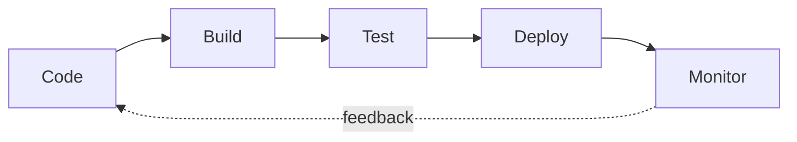

# GitHub Actions

### CI/CD where your code already lives

<div class="abs-bl m-6 text-sm opacity-60">
  A 5-minute tour · for informatics students
</div>

<div class="abs-br m-6 text-xl">
  <carbon:logo-github />
</div>

<style>
:root {
  --slidev-theme-primary: #2da44e;
}
h1 {
  background: linear-gradient(90deg, #2da44e 0%, #8957e5 100%);
  -webkit-background-clip: text;
  background-clip: text;
  color: transparent;
  font-weight: 800;
}
</style>

<!--
Welcome — five minutes, eight slides. We'll start with the *why* (CI/CD), see what GitHub Actions actually is, write a workflow file together, then close with what it can't do well. Keep it brisk: roughly 30–40 seconds per slide except the YAML walkthrough, which gets 90 seconds.
-->

---
transition: fade-out
---

# Why CI/CD?

<v-clicks>

- **Continuous Integration** — every commit is automatically built and tested.
- **Continuous Delivery / Deployment** — green builds flow toward production without manual steps.
- It exists to kill three classic pains: <span v-mark.underline.orange="3">"works on my machine"</span>, broken `main`, and risky manual releases.

</v-clicks>

<div v-click="4" class="mt-8">



</div>

<!--
CI/CD is the loop you want around every codebase. CI = automatically build and test on every commit. CD = automatically ship the green builds. The motivation is concrete: it eliminates the "works on my machine" excuse, prevents broken `main`, and replaces stressful manual deploys with boring automation. Show the loop — that's the workflow we're going to automate. ~40 seconds.
-->

---
layout: two-cols
layoutClass: gap-12
---

# Enter GitHub Actions

GitHub's built-in CI/CD platform.

<v-clicks>

- **Native to your repo** — lives in `.github/workflows/`
- **Event-driven** — triggered by pushes, PRs, releases, schedules…
- **Free for public repos**, generous tier for private
- **Reusable building blocks** from the Marketplace

</v-clicks>

::right::

<div class="mt-12">

```yaml {all|2}
name: CI
on: [push, pull_request]
```

<div v-click class="text-sm opacity-70 mt-4">
The <code>on:</code> key answers <strong>"when does this run?"</strong>
</div>

</div>

<!--
GitHub Actions is GitHub's own CI/CD service — no extra accounts, no separate dashboard. Workflows are YAML files committed in `.github/workflows/`. They're event-driven: a push, a PR, a tag, a cron schedule, even an issue comment can trigger them. Free for public repos. The Marketplace gives you thousands of reusable steps so you rarely write shell from scratch. ~30 seconds.
-->

---

# What can you automate?

<div class="grid grid-cols-2 gap-6 mt-8">

<div v-click class="p-4 rounded border border-green-500/30 bg-green-500/5">
  <div class="text-2xl"><carbon:test-tool /></div>
  <div class="font-bold mt-1">Tests & linting</div>
  <div class="text-sm opacity-70">on every push and PR</div>
</div>

<div v-click class="p-4 rounded border border-green-500/30 bg-green-500/5">
  <div class="text-2xl"><carbon:build-tool /></div>
  <div class="font-bold mt-1">Builds & artifacts</div>
  <div class="text-sm opacity-70">binaries, Docker images, bundles</div>
</div>

<div v-click class="p-4 rounded border border-purple-500/30 bg-purple-500/5">
  <div class="text-2xl"><carbon:deploy /></div>
  <div class="font-bold mt-1">Deploys</div>
  <div class="text-sm opacity-70">GitHub Pages, AWS, Vercel, …</div>
</div>

<div v-click class="p-4 rounded border border-purple-500/30 bg-purple-500/5">
  <div class="text-2xl"><carbon:bot /></div>
  <div class="font-bold mt-1">Repo automation</div>
  <div class="text-sm opacity-70">label PRs, close stale issues, cron jobs</div>
</div>

</div>

<!--
Four buckets students will recognize. Tests and linting on every PR — the bread and butter. Builds and artifacts — produce the binary or Docker image, attach it to a release. Deploys — push to Pages, a cloud provider, or your university's server. And repo automation — labeling PRs, closing stale issues, nightly scheduled tasks. Anything you can do in a shell, you can do here. ~30 seconds.
-->

---
level: 2
---

# Anatomy of a workflow

A workflow grows in five small steps. Same file, click to evolve.

````md magic-move {lines: true}
```yaml {*|1-2}
name: CI
on: [push, pull_request]
```

```yaml {*|3-5}
name: CI
on: [push, pull_request]

jobs:
  test:
    runs-on: ubuntu-latest
```

```yaml {*|7-8}
name: CI
on: [push, pull_request]

jobs:
  test:
    runs-on: ubuntu-latest
    steps:
      - uses: actions/checkout@v4
```

```yaml {*|9-12}
name: CI
on: [push, pull_request]

jobs:
  test:
    runs-on: ubuntu-latest
    steps:
      - uses: actions/checkout@v4
      - uses: actions/setup-node@v4
        with:
          node-version: 20
```

```yaml {*|13-14}
name: CI
on: [push, pull_request]

jobs:
  test:
    runs-on: ubuntu-latest
    steps:
      - uses: actions/checkout@v4
      - uses: actions/setup-node@v4
        with:
          node-version: 20
      - run: npm ci
      - run: npm test
```
````

<!--
The centerpiece — give it 90 seconds.

1. `name` and `on:` — *when* does it run? On any push or pull request.
2. Add a `job` and `runs-on:` — *where* does it run? GitHub spins up a fresh Ubuntu VM.
3. Add `steps:` with `actions/checkout@v4` — the very first step almost always grabs your code. Notice `uses:` — we're invoking a reusable action.
4. Add `actions/setup-node@v4` with `with:` — actions take parameters. Here we pin Node 20.
5. Finally, `run:` — your own shell commands. Install, then test.

Thirteen lines. That's a real CI pipeline. Push the file to `.github/workflows/ci.yml` and the next PR runs it.
-->

---
layout: two-cols
layoutClass: gap-12
---

# Runners & the Marketplace

<v-clicks>

- **Runners** = the VMs that execute your jobs
  - GitHub-hosted: Linux, macOS, Windows
  - Or self-hosted, on your own hardware
- **Marketplace** = thousands of reusable `uses:` actions
- **Secrets** keep tokens out of YAML

</v-clicks>

::right::

<div class="mt-12">

```yaml
- uses: actions/setup-python@v5
  with:
    python-version: '3.12'

- name: Deploy
  env:
    TOKEN: ${{ secrets.DEPLOY_TOKEN }}
  run: ./deploy.sh
```

</div>

<!--
Two pieces worth naming. *Runners* are the machines — GitHub gives you fresh Linux, macOS, and Windows VMs for free; you can also self-host if you need GPUs or special networks. The *Marketplace* is the package registry of CI: thousands of community actions you reference with `uses:`. And `secrets` — never paste tokens in YAML; store them in repo settings and read them via `${{ secrets.X }}`. ~30 seconds.
-->

---

# Limitations & gotchas

<v-clicks>

- 💸 **Minutes cost money on private repos** — 2,000 free/month, then per-minute billing.
- 🔒 **Vendor lock-in** — workflows don't run outside GitHub (partial workaround: [`act`](https://github.com/nektos/act)).
- 🐛 **Painful debugging** — no local step-through. You push commits to test, watch logs, push again.
- 📐 **YAML pitfalls** — indentation matters, no type checking, secrets leak into logs if you `echo` them.
- ⚠️ **Supply-chain risk** — `uses: some-action@v1` follows a moving tag. Pin to a commit SHA for security-critical jobs.
- 🥶 **Cold starts** — every job boots a fresh VM (~10–30 s overhead).

</v-clicks>

<!--
Be honest about the trade-offs. Minutes are free for public repos but metered for private — at scale the bill shows up. Workflows are GitHub-specific; migrating to GitLab or Jenkins means a rewrite. Debugging is the biggest day-to-day frustration: there's no breakpoint, you commit-push-watch-repeat. YAML has no type system and no compiler, so a typo fails after the VM has already booted. The supply-chain point matters: `@v1` is a moving tag — for security-sensitive workflows pin to a commit SHA. And every job pays a cold-start tax. ~45 seconds.
-->

---
layout: center
class: text-center
---

# That's it.

When it shines: anything already on GitHub, especially open source.

<div class="mt-8 text-sm opacity-70">
  📚 <a href="https://docs.github.com/actions" target="_blank">docs.github.com/actions</a>
  ·
  🛒 <a href="https://github.com/marketplace?type=actions" target="_blank">Marketplace</a>
  ·
  🧪 <a href="https://github.com/nektos/act" target="_blank">nektos/act</a> (run locally)
</div>

<div class="mt-16 text-xs opacity-40">
  Questions?
</div>

<!--
Five minutes, one workflow file, and a sense of when GitHub Actions is the right tool: when your code already lives on GitHub, especially for open source where it's free. Three links to take home — the official docs, the Marketplace for reusable actions, and `act` for running workflows locally. Open the floor for questions.
-->
